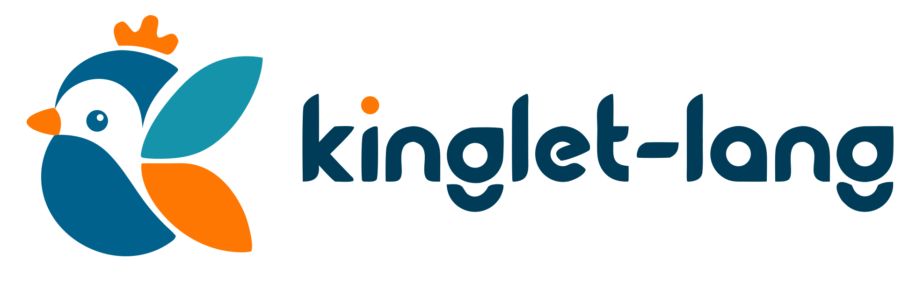

> **Bootstrap (Ref)** — C++ reference compiler and VM host for Kinglet: lexer, parser, checker, bytecode VM, KIR, and optional LLVM native (`enable_llvm=true`). Language design, ADRs, self-host tests, and `kinglet build` live in [kinglet-lang/kinglet](https://github.com/kinglet-lang/kinglet); this repo is the bootstrap stage used until v0 native execution ships.

<p align="center">
  <picture>
    <source media="(prefers-color-scheme: dark)" srcset="assets/kinglet-brand-dark.svg">
    <source media="(prefers-color-scheme: light)" srcset="assets/kinglet-brand.svg">
    
  </picture>
</p>

<p align="center">A bytecode-compiled language exploring the C++ proposals that deserved a second life.</p>

<p align="center">
  <a href="https://github.com/kinglet-lang/bootstrap/releases"></a>
  <a href="https://github.com/kinglet-lang/bootstrap/actions"></a>
  <a href="LICENSE"></a>
</p>

> [!NOTE]
> Familiar semantics. Curated ideas from WG21 proposals that were deferred or rejected. Kinglet is proposal-inspired, not proposal-compatible: it adapts syntax and semantics when that makes the language smaller, clearer, or more coherent.

## Install

Download the latest release for your platform from [Releases](https://github.com/kinglet-lang/bootstrap/releases):

| Platform | Archive |
|----------|---------|
| Windows x64 | `kinglet-windows-x64.tar.gz` |
| Linux x64 | `kinglet-linux-x64.tar.gz` |
| macOS ARM64 | `kinglet-macos-arm64.tar.gz` |

Extract and add the directory to your `PATH`:

```bash
tar xzf kinglet-<platform>.tar.gz
# Move kinglet (or klet) to a directory on your PATH
```

`klet` is the same binary as `kinglet` — a short alias for the CLI driver (`klet build` ≡ `kinglet build`).

Editor extensions live in [kinglet-lang/lsp](https://github.com/kinglet-lang/lsp) (planned separate repo).

## Build

```bash
gn gen out/Release --args='is_debug=false'
ninja -C out/Release
./out/Release/kinglet [--tokens | --ast | --bytecode | --repl] <file.kl>
```

## Quick Example

```cpp
using io;

struct Point {
  int x;
  int y;
}

struct Box<T> {
  T value;
}

T identity<T>(T x) => x;

int distance_sq(Point a, Point b) {
  int dx = a.x - b.x;
  int dy = a.y - b.y;
  return dx * dx + dy * dy;
}

int main() {
  Point origin { 0, 0 };
  Point target { 3, 4 };
  io::out("{}\n", distance_sq(origin, target)); // 25

  Box<int> bi { 42 };
  Box<string> bs { "hello" };
  io::out("{}\n", bi.value);            // 42
  io::out("{}\n", identity<string>("world")); // world

  // Mutation
  target.x = 6;
  target.y = 8;
  io::out("{}\n", distance_sq(origin, target)); // 100

  return 0;
}
```

## Syntax

```cpp
// Types
int x = 42;
double pi = 3.14;
string name = "kinglet";
bool flag = true;

// Dynamic arrays
int[] xs = [1, 2, 3];
xs[1] = 20;
int first = xs[0];

// Structs & Enums
struct Vec2 { int x; int y; }
enum Color { Red, Green, Blue, }
Vec2 v { 1, 2 };
Color c = Color::Red;

// Generics (monomorphized)
struct Pair<A, B> { A first; B second; }
T identity<T>(T x) => x;
Pair<int, string> p { 1, "one" };
int n = identity<int>(42);

// Control flow
if x > 0 { ... } else { ... }
while count > 0 { ... }
for (int i = 0; i < 10; i = i + 1) { ... }

// Pattern matching (P2688R5-style postfix match)
string r = value match {
  0 => "zero",
  1 => "one",
  let x if x > 50 => "big",
  _ => "other",
};

// I/O
using io;
io::out("{} + {} = {}\n", 1, 2, 3);
string line = io::in("prompt> ");

// Functions
int add(int a, int b) => a + b;
int factorial(int n) {
  if n <= 1 { return 1; }
  return n * factorial(n - 1);
}
```

## Operators

`+` `-` `*` `/` `%` `==` `!=` `<` `>` `<=` `>=` `&&` `||` `!` `~`
